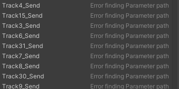

# Audio Mixer

BroAudio uses a custom [Audio Mixer](https://docs.unity3d.com/Manual/AudioMixer.html) with 32 tracks (matching Unity's default [Max Real Voices](../bro-wiki/audio-terminology.md#real-voices-and-virtual-voices)), plus 4 [virtual tracks](audio-mixer.md#virtual-tracks), 4 [dominator](dominator-player.md) tracks, 1 effect track. This design offers great flexibility in controlling sounds and can prevent many common issues (e.g. sound distortion).\
\
Normally, you don't need to make any changes to this mixer, Bro has taken care of everything for you. But if you understand how the [Audio Mixer](https://docs.unity3d.com/Manual/AudioMixer.html) and Exposed Parameters work, you can certainly adjust it yourself. You just need to pay attention to the following few things:

### 1. There are bugs in Unity Audio Mixer's "Send" unit

Yes, [there's a bug in the Unity Audio Mixer](https://issuetracker.unity3d.com/issues/audio-mixer-unable-to-expose-other-send-level-parameters-when-one-is-already-exposed) (which has only been fixed in newer versions), but you don't need to worry about it, as Bro has already handled it for you. The only drawback is that when you open the Exposed Parameters menu in the [Audio Mixer](https://docs.unity3d.com/Manual/AudioMixer.html) window, you will see a lot of '<mark style="color:red;">Error finding parameter path</mark>' messages. However, **rest assured that their functions are still working properly!**

[further detail](audio-mixer.md#what-was-the-issue-with-that-bug-and-how-was-it-resolved)

<figure><figcaption>
Don't worry about these error messages
</figcaption></figure>


Another problem with the "[Send](https://docs.unity3d.com/Manual/AudioMixerInspectors.html)" units in the Unity Audio Mixer is, the editor can only accept send level from -80 to 0dB, but it's actually capable for a value up to +20dB, like the "Attenuation" unit's volume.&#x20;

If you see the send level's editor slider is gone, then again,  **rest assured that their functions are still working properly!**


### 2. Matching the 'Max Real Voices'&#x20;

If you've changed the Max Real Voices in [Project Settings](https://docs.unity3d.com/Manual/class-AudioManager.html) to a value that is greater than 32. Locate **Tools/BroAudio/Settings**, and you should see a warning that indicates the unmatching voice count issue, and a button appears below, which could help you to match them (increase the track count) automatically, Just hit it!

## Virtual tracks

## What was the issue with that bug? And how was it resolved?

##
