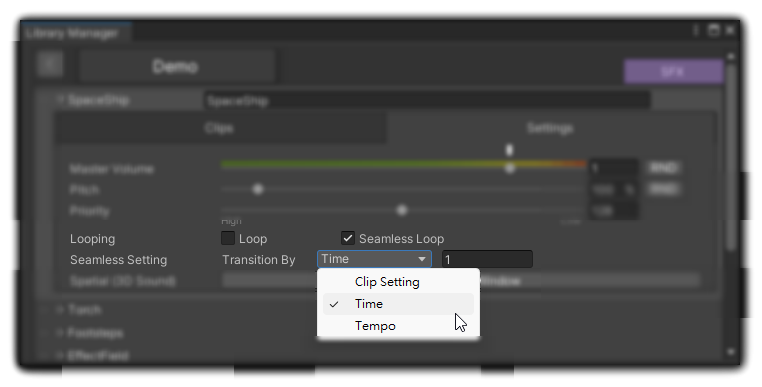

# Seamless Loop

## Introduction 

Looping allows an [AudioClip](https://docs.unity3d.com/Manual/class-AudioClip.html) to be continuously replayed. It's a common technique used for playing sounds like **Music** and **Ambience** in games. However, if a sound is not specifically designed for looping, its beginning and end might not match seamlessly. Direct replay would result in a noticeable change.

This is where **SeamlessLoop** comes in. It enables an [AudioClip](https://docs.unity3d.com/Manual/class-AudioClip.html) to start playing again on a new audio track just before the current one finishes. By gradually [cross-fading](fade-in-out-and-cross-fade.md#crossfade) between the two tracks, it creates an illusion that the sound never stops at all.

## **How To Use?**

You can find the **Looping** option in the 'Settings' tab of an AudioEntity. If one of the looping options is selected, the AudioEntity will play accordingly.\
[<mark style="color:blue;">Didn't see the option?</mark>](#user-content-fn-1)[^1]

<figure><figcaption></figcaption></figure>

### Loop

The sound will replay when it's finished.

### Seamless Loop

The sound will replay **before** it ends.

If this option is selected, "Seamless Setting" will appear, allowing you to set the transition timing.

1. **Clip Setting:** The replay begins as the clip starts fading out.
2. **Time:** The replay starts a specified number of seconds before the end.
3. **Tempo:** The replay starts a specified number of beats before the end.

[^1]: If you can't see this option, it might be because the GUI setting of this AudioType is set to be invisible. Click here for more details.
