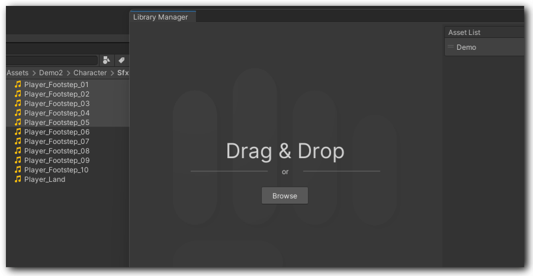
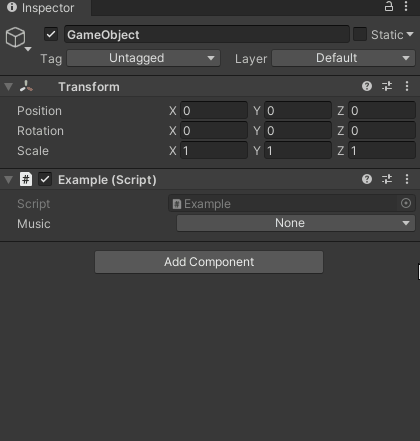

# Getting Started

## Installation

Install via Unity's Package Manager

## Creating sound libraries

Locate _**Tools/BroAudio/LibraryManager**_ in the Unity menu bar.

### Create an Asset and Entity by drag and drop

<figure><figcaption></figcaption></figure>

If multiple clips are dropped, a confirmation window will appear, asking how you would like to structure them.

### Name it and choose an [AudioType](bro-wiki/broaudio.md#audiotype)

You could also skip this step and start editing. It will be saved as a Temp entity. Just remember to set it before you actually need them in your scene.

### Edit the parameters

edit the clip's volume, playback position... etc.

## Implementation

### Declare an [AudioID](bro-wiki/broaudio.md#audioid) and use BroAudio.Play() to play it

#### Set the AudioID in the Inspector

The AudioID is the entity name that you've created in LibraryManager

#### Hit the Unity play button and enjoy it !

That's all you need to start using BroAudio. Of course, there are more than just this. Check out the documentation to fully unlock all the features of BroAudio.

\
