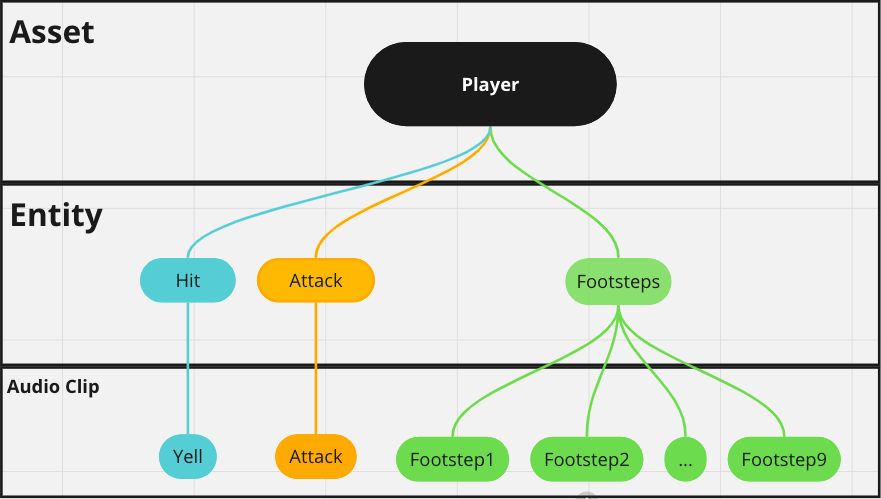

# Library Manager

The library is primarily composed of two data structures: **Asset** and **Entity**. Their relationship is illustrated in the following diagram:

<figure><figcaption></figcaption></figure>

## Asset

Asset is a [ScriptableObject](https://docs.unity3d.com/Manual/class-ScriptableObject.html) that contains a collection of Entities. You can group commonly used sounds together in the same Asset. As you can see in the diagram above, all sounds related to the Player are stored within the Player Asset.

~~目前各個Asset之間僅有名字的差異，所以區分方式並沒有任何的限制。不過未來將會有針對記憶體優化的更新，聲音資源的載入將會使用Asset來區分，詳見：~~

## **Entity**

An Entity represents a single sound, so when it is played, only one AudioClip from its ClipList will be played. Here, we set which AudioClip it should play, how it should be played, and what kind of performance it will have during playback.

### AudioID

When an entity is created in the LibraryManager, an AudioID is automatically generated. Once the AudioID is serialized (by \[SerializedField] or public), a dropdown menu appears in the inspector.

[see how to do this in action](../overview/getting-started.md#declare-an-audioid-and-use-broaudio.play-to-play-it)

###

##
